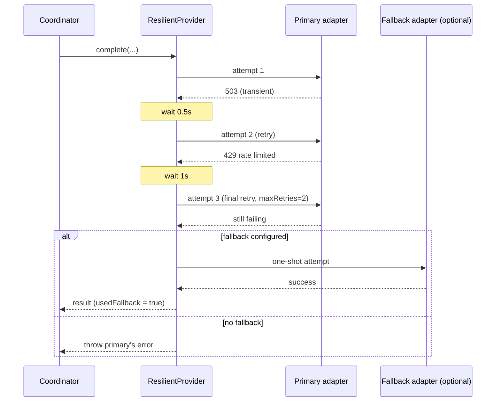
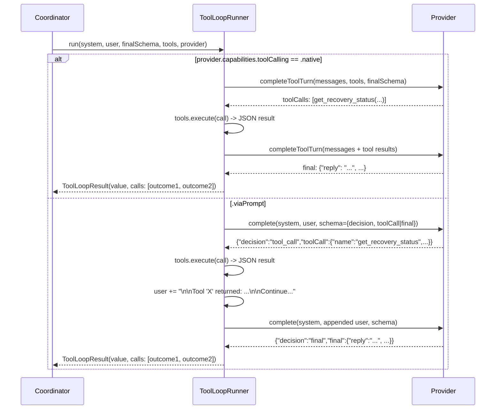
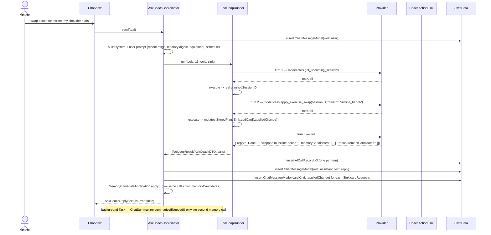
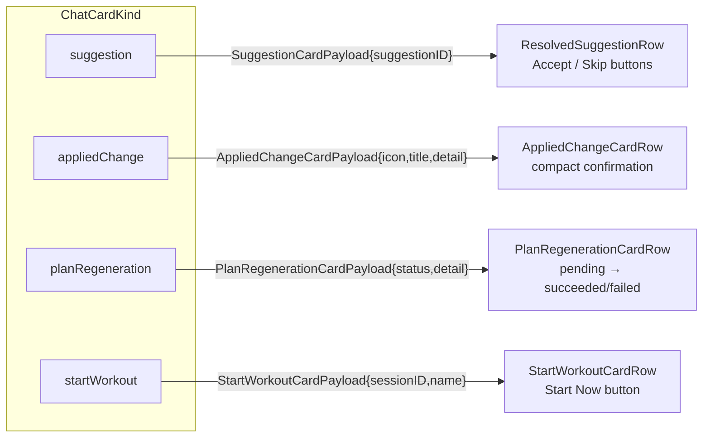
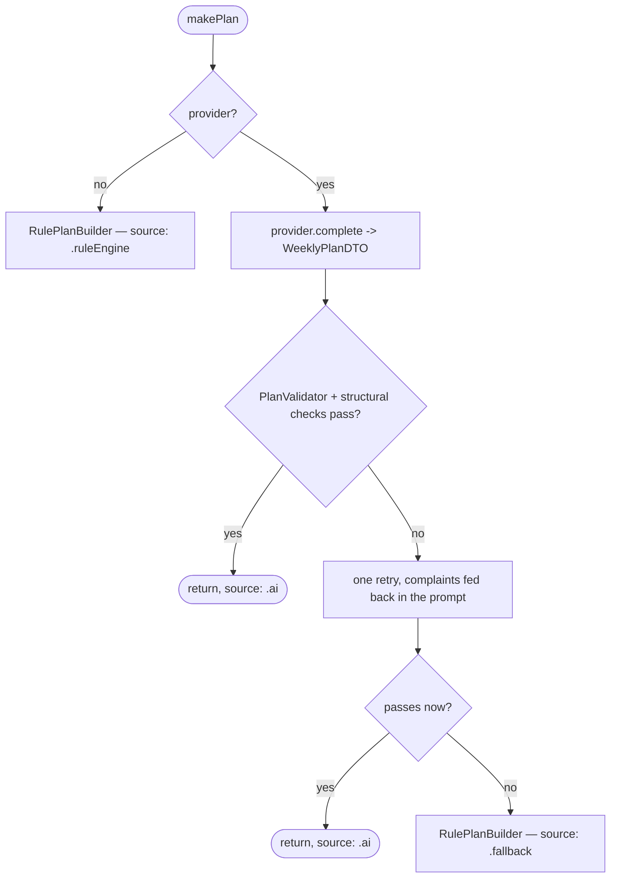

# 13 — AI Architecture Reference (as-built)

_Living reference, not a design-phase doc. Reflects the code as it exists on `fitness-engine-v2` today. Update this alongside the code — it drifts otherwise._

This is the one document to read to understand how every AI-touching feature in the app actually works: which coordinator runs when, what it sends the model, what tools it can call, what it's allowed to change, and how it's billed. Docs `10` (provider architecture options) and the `specs/2026-09-05-*` files capture the *design intent*; this captures *what got built*.

---

## 1. One-paragraph mental model

Every AI feature in the app is one of six independent **coordinators**, each a thin `@MainActor struct` that: reads exactly the SwiftData context it needs, builds a system+user prompt, runs it through a shared **`ToolLoopRunner`** (which drives either a provider's native function-calling API or a hand-rolled JSON-envelope loop, transparently), and applies the structured result back to the model layer. There is no central orchestrator or router deciding *which* agent runs — the six coordinators are triggered directly by the UI/app-lifecycle event that owns them (a chat send, a finished session, an app foreground, a 30-message chat threshold). One provider abstraction (`LLMProvider`) is implemented by six adapters (OpenAI-compatible, OpenRouter, Gemini, Vertex AI, Bedrock, Apple on-device), all wrapped in `ResilientProvider` for retry/failover. Every real call is billed as an `AICallRecord` row, whether it succeeded, failed, or used a fallback.

```mermaid
graph TB
    subgraph UI["SwiftUI Layer"]
        Chat[ChatView]
        Home[HomeView / CoachInboxView]
        Session[SessionContainerView]
        Onboard[RootView onboarding]
        Settings[ProviderProfileEditView]
    end

    subgraph Coordinators["Coordinators (AI/*.swift)"]
        Ask[AskCoachCoordinator]
        Plan[PlanCoordinator / PlanGeneration]
        Finalize[SessionFinalizeCoordinator]
        MemKeep[MemoryKeeperCoordinator]
        Summarize[ChatSummarizer]
        Proactive[ProactiveCoordinator]
    end

    Loop[ToolLoopRunner]
    Resilient[ResilientProvider]

    subgraph Adapters["LLMProvider adapters"]
        OAI[OpenAICompatibleProvider]
        OR[OpenRouterProvider]
        Gem[GeminiProvider]
        Vertex[VertexAIProvider]
        Bed[BedrockProvider]
        Apple[FoundationModelsProvider]
    end

    DB[(SwiftData store)]

    Chat --> Ask
    Home --> Ask
    Session --> Finalize
    Session --> MemKeep
    Onboard --> Plan
    Settings -.configures.-> Resilient

    Ask --> Loop
    Finalize --> Loop
    MemKeep --> Loop
    Summarize --> Loop
    Proactive --> Loop
    Plan -. direct provider.complete, no tools .-> Resilient

    Loop --> Resilient
    Resilient --> OAI
    Resilient --> OR
    Resilient --> Gem
    Resilient --> Vertex
    Resilient --> Bed
    Resilient --> Apple

    Ask <--> DB
    Finalize <--> DB
    MemKeep <--> DB
    Summarize <--> DB
    Proactive <--> DB
    Plan <--> DB
```

---

## 2. The provider layer

### 2.1 `LLMProvider` — the one interface every adapter implements

`FitnessCore/Sources/LLMKit/LLMProvider.swift`:

```swift
protocol LLMProvider: Sendable {
    var capabilities: ProviderCapabilities { get }
    func complete<Value: Decodable & Sendable>(system:user:schema:as:) async throws -> LLMResult<Value>
    func completeWithImage<Value: Decodable & Sendable>(system:user:image:schema:as:) async throws -> LLMResult<Value>
    func completeToolTurn<Final: Decodable & Sendable>(system:messages:tools:finalSchema:as:) async throws -> NativeToolTurnResult<Final>
}
```

Three verbs, no more: a plain structured completion, a multimodal (image) completion, and one turn of native tool-calling. `completeToolTurn` has a default (`throw .unsupported`) so a prompt-only provider needs zero extra code.

### 2.2 The six adapters

| Adapter | `AdapterKind` | Auth | Structured output | Tool calling (default) |
|---|---|---|---|---|
| `OpenAICompatibleProvider` | `.openAICompatible` | API key, custom base URL | `nativeJSONSchema` on `api.openai.com`, else `jsonObject` | `.native` on `api.openai.com`, else `.viaPrompt` (per-profile override available) |
| `OpenRouterProvider` | `.openRouter` | API key | Delegates to the wrapped model's own real capability (was hardcoded wrong — fixed) | Delegates to inner provider |
| `GeminiProvider` | `.gemini` | API key | `nativeJSONSchema` | `.native` |
| `VertexAIProvider` | `.vertexAI` | OAuth2 bearer token, GCP project/location | `nativeJSONSchema` | `.native` |
| `BedrockProvider` | `.bedrock` | AWS SigV4 (access key/secret/session token) | `promptOnly` | `.viaPrompt` |
| `FoundationModelsProvider` | `.appleOnDevice` | none (on-device) | guided generation | see file — on-device only, needs a real Apple Intelligence device |

`ProviderProfileEditView` auto-fills the base URL for every known host (OpenAI, Groq, Together, DeepSeek, Fireworks, Mistral, Ollama-local, or Custom) so setup is model + key only — the base URL used to be a free-text field users had to know by heart.

`KnownOpenAICompatibleHost`, `VertexAIURL.build/.parse`, and the Bedrock credential-JSON parser all live in `ProviderProfileEditView.swift` / `BedrockProvider.swift`.

### 2.3 `ProviderCapabilities` — capabilities are declared, never guessed at runtime

```swift
struct ProviderCapabilities {
    enum StructuredOutput { case nativeJSONSchema, jsonObject, promptOnly }
    enum ToolCalling { case native, viaPrompt }
    var streaming: Bool
}
```

`ToolLoopRunner` reads `provider.capabilities.toolCalling` once and picks a lane — it never probes or falls back mid-call. A per-profile override (`ProviderProfile.capToolCallingRaw`) lets a specific model (e.g. an OpenRouter model known to support real function calling) opt into the native lane even though its host's *default* is `.viaPrompt`.

### 2.4 `ResilientProvider` — retry + failover, applied uniformly

Every real provider built by `LLMProviderFactory.make(from:)` is wrapped in one `ResilientProvider`:



Rules, exactly as implemented:
- **Retryable:** `rateLimited`, and any `transport` error whose message doesn't contain `"HTTP 4"` (so 5xx, timeouts, connection resets — not 4xx).
- **Never retried:** any 4xx, `decoding` failures, `visionUnsupported`, `unsupported` — these are deterministic, retrying won't change the outcome.
- **Failover** happens once, only after the primary's retries are exhausted, and only if a fallback profile is configured. If the fallback *also* fails, the **primary's** error is surfaced (it's the one the user configured and needs to see).
- `CancellationError` propagates immediately, never retried or failed over.
- A successful failover stamps `usedFallback = true` on the `LLMResult`, which flows straight into the `AICallRecord` row.

---

## 3. `ToolLoopRunner` — one loop, two lanes

Every coordinator that needs tools (five of six — `PlanCoordinator` is the exception, see §5.4) goes through the same `ToolLoopRunner.run(system:initialUser:finalSchema:tools:provider:maxIterations:)`. It picks a lane once, up front, based on `provider.capabilities.toolCalling`:



- **Native lane** (`runNative`): real multi-turn message history (`[ToolChatMessage]`), the provider's own function-calling wire format. Used by OpenAI-on-`api.openai.com`, Gemini, Vertex AI, and any profile explicitly opted in.
- **Prompt lane** (`runPrompt`): no native tool API assumed. The model is asked to emit one JSON envelope per turn — `{"decision":"tool_call","toolCall":{...}}` or `{"decision":"final","final":{...}}` — and the tool result gets appended as plain text for the next turn. Works with *any* provider, which is why it's the default for everything except the handful of hosts explicitly proven to support native tools.
- Both lanes cap at `maxIterations` (default 4) and throw `ToolLoopError.exceededMaxIterations` if the model never converges — carrying every billable `CallOutcome` made so far, so a run that never converges is still billed accurately instead of discarded.
- A mid-loop provider failure (`ToolLoopError.providerFailed`/`providerFailedWithMessage`) similarly carries every prior successful sub-call plus the failed one.
- Every tool call and its (truncated) result is logged via `os.Logger` under `subsystem: com.varunmotiyani.TrainSage, category: ToolLoop` — filterable in Console to answer "did the coach actually look at anything, or just talk?"

### 3.1 `CoachTool` — the tool contract

```swift
protocol CoachTool: Sendable {
    var descriptor: ToolDescriptor { get }
    func run(argsJSON: String) -> String   // never throws
}
```

A tool never throws to the loop — a failure becomes a `{"error": "..."}` string the model reads and can react to (try something else, ask a clarifying question) instead of crashing the turn. `ToolRegistry` maps tool name → implementation and returns `{"error": "unknown tool '...'"}"` for anything the model hallucinates.

---

## 4. The six coordinators

| Coordinator | Triggered by | Tools | Falls back to | Bills as (`callType`) |
|---|---|---|---|---|
| `AskCoachCoordinator` | User sends a chat message | 13 tools (§4.1) | Rule-engine plan (only for `regenerate_plan`); otherwise a user-facing error string — **never silent**, someone is looking at the screen | `askCoach` |
| `PlanCoordinator` (via `PlanGeneration.generateAndStore`) | Onboarding, Settings "Regenerate weekly plan", chat's `regenerate_plan` tool | none — one structured call, no tool loop | `RulePlanBuilder` (deterministic rule engine) after validation fails twice | `plan` (see `generateAndStore`) |
| `SessionFinalizeCoordinator` | Starting a planned session | `plate_math`, `estimate_one_rep_max`, `query_training_data` | `RuleEngineFinalizer`, under a hard timeout (`SessionFinalizationTimeout`) so a slow model never blocks session start | `finalize` |
| `MemoryKeeperCoordinator` | A completed session finishes | `query_training_data` | Silent no-op — no provider, any error, or a decode failure all resolve to "nothing written, nothing billed" | `memoryKeeper` |
| `ChatSummarizer` | Chat history exceeds 30 messages | none | Silent no-op (transcript just stays a bit longer) | `chatSummarize` |
| `ProactiveCoordinator` | App foreground, gated by once-per-day/week `UserDefaults` flags | none | Deterministic template text (`generateFallbackDaily`/`Weekly`) | `dailyNarration`, `weeklySummary`, `patternNudge` |

Nothing routes through a shared "which agent should handle this" layer — each of these six is wired directly to the one real-world event that should trigger it. A "smart orchestrator" pattern was explicitly considered and rejected: it would mean paying for an extra classification call before the reply call, for no reduction in what the reply call itself has to do (see §8).

### 4.1 Ask Coach's tools — the model's full action surface

Built in `AskCoachCoordinator.buildTools(sink:)`, registered every single chat turn:

| Tool | Kind | What it does |
|---|---|---|
| `get_recovery_status` | read-only | Per-muscle recovery state from completed session history |
| `get_muscle_balance` | read-only | Weekly effective-set load per muscle group |
| `query_training_data` | read-only | Model-authored JMESPath-subset query over the full training-history export (see §4.2) |
| `get_upcoming_sessions` | read-only | Lists the current plan's not-yet-done sessions — used to find a real `plannedSessionID` before any write tool, never guessed |
| `propose_exercise_swap` | proposal (card) | Writes a `PendingCoachSuggestion` + a `.suggestion` chat card the athlete taps Accept/Skip on |
| `propose_set_change` | proposal (card) | Same, for a target-sets change |
| `propose_routine_revision` | proposal (memory) | A standing preference that reshapes *future* plans, not this session |
| `apply_exercise_swap` | direct action | The athlete explicitly asked for this swap — mutates the stored plan immediately, no approval card |
| `apply_set_change` | direct action | Same, for a target-sets change |
| `start_workout` | direct action | Emits a `.startWorkout` card with its own "Start Now" button — no silent auto-navigation |
| `regenerate_plan` | direct action | Only flags `sink.requestedPlanRegeneration` — the coordinator does the actual (awaitable) regeneration after the tool loop, since a synchronous tool can't `await` |
| `set_day_to_rest` | direct action | Overrides one date's schedule to rest |
| `log_bodyweight` | direct action | Writes a `BodyweightEntryModel` |

**Proposal vs. direct action** is the model's own judgment call, steered by the system prompt: *"the athlete explicitly asked you to change something... do it immediately, don't make them tap a card for their own direct request"* vs. *"a suggestion card for an upcoming session, for when you're recommending something rather than executing an explicit instruction."*

### 4.2 Who writes the JMESPath query?

The model does. `QueryTrainingDataTool`'s descriptor hands the model the syntax directly:

```json
{"query": "string, e.g. workouts[].entries[] | [?exerciseId=='0025']"}
```

When the coach needs an exact historical fact not already in its context (e.g. "what was my squat max in March"), it emits the query string as the tool-call argument. `PulseQuery.evaluate` (`FitnessCore/Sources/Metrics/PulseQuery.swift`) executes whatever string comes back against a lazily-exported, memoized full-history JSON blob — app code never constructs a query itself.

---

## 5. Deep dive: a chat message, end to end



Two things worth calling out because they weren't always true:

1. **Memory extraction used to be a second, separately-billed LLM call** (`MemoryKeeperCoordinator.run(chatExchange:)`) fired after *every* chat message, with its own full system prompt, purely to decide "is there anything worth remembering here" — usually answering "no." This is now folded into `AskCoachDTO` itself (`memoryCandidates`/`measurementCandidates` fields) — the same model turn that's already reading the message makes that call, at the cost of a couple more JSON fields instead of a whole second round trip. `MemoryKeeperCoordinator` now only ever runs from a finished session (§4, row 4), which is a genuinely different, correctly-scoped trigger with data (session entries, today's check-in) Ask Coach doesn't have.
2. **`regenerate_plan` can't `await`** — a `CoachTool.run` is synchronous. So the tool only flags `sink.requestedPlanRegeneration = true`; the actual (network-bound) regeneration happens in `AskCoachCoordinator.send` *after* the tool loop returns, in a context that's already `async`. A `.planRegeneration` card is inserted `.pending` immediately (so the transcript shows live status) and mutated in place to `.succeeded`/`.failed` once generation settles — replacing an earlier design that appended the outcome as plain text onto the reply, which could arrive after the caller had already read `reply.text` and silently vanish.

---

## 6. Structured chat: the card system

A `ChatMessageModel` normally just renders as text. Four `ChatCardKind` values let a message carry structured UI instead:



| Card | When it appears | Payload example |
|---|---|---|
| `.suggestion` | `propose_exercise_swap` / `propose_set_change` write a `PendingCoachSuggestion` | `{"suggestionID": "..."}` — resolved live against the actual `PendingCoachSuggestion` row (via `@Query`), so its Accept/Skip state stays in sync with Home's own suggestion card |
| `.appliedChange` | Any direct-action tool succeeds (`apply_exercise_swap`, `apply_set_change`, `set_day_to_rest`, `log_bodyweight`) | `{"icon":"arrow.triangle.2.circlepath","title":"Exercise swapped","detail":"bench → incline_bench"}` |
| `.planRegeneration` | `regenerate_plan` is called | Inserted `{"status":"pending","detail":null}`, later mutated to `{"status":"succeeded","detail":"Coach updated (rule engine)"}` |
| `.startWorkout` | `start_workout` is called | `{"plannedSessionID":"...","sessionName":"Push Day"}` — its "Start Now" button only renders when the view was given both `plan` and `onStartSession` |

`ChatView` branches per-message: `message.cardKind != nil` renders `ChatCardView` (the card switch), otherwise the original `CoachChatBubble`. Every message a tool produces gets its **own** card row right after the reply — the athlete sees a real recorded outcome, not just the model's prose claiming one happened.

---

## 7. Memory: recall, extraction, consolidation

```mermaid
graph LR
    subgraph Read path — every AI touchpoint
        CMM[(CoachMemoryModel rows)] --> Recall[MemoryRecall.select]
        Recall -->|"ranked, capped at 8,<br/>30-day half-life decay"| Digest[memoryDigestWithIDs]
        Digest -->|"'- [uuid] statement → action'"| Prompt[system/user prompt]
    end

    subgraph Write path
        LLMOut["Model output:<br/>memoryCandidates[]"] --> Apply[MemoryCandidateApplication]
        Apply --> Reconcile[MemoryConsolidation.reconcile]
        Reconcile -->|new| Write[insert CoachMemoryModel]
        Reconcile -->|reinforces uuid| Update[bump confidence, lastConfirmedAt]
        Reconcile -->|contradicts uuid| Retire[mark superseded/retired]
    end
```

- **Recall** (`MemoryRecall.select`) is deterministic, not model-driven: relevance filtering against a `RecallContext` (exercise IDs / muscles / equipment in play) plus a confidence half-life, capped at 8 items so the digest never grows unbounded.
- **Extraction** is the model's job — every touchpoint that can write memory (`SessionFinalizeCoordinator`'s guardrail note, `MemoryKeeperCoordinator` post-session, and now `AskCoachCoordinator`'s own reply) emits `MemoryCandidateDTO`/`MeasurementCandidateDTO` in its structured output, tagged `relation: new | reinforces | contradicts` with the bracketed `[uuid]` from the digest echoed back for `reinforces`/`contradicts`.
- **Consolidation** (`MemoryConsolidation.reconcile`) is pure Swift, fully deterministic, shared by every write path via `MemoryCandidateApplication` (one function, not duplicated per-coordinator) — the model never touches storage directly, it only proposes.
- **Measurement candidates** (an InBody scan number stated in chat) go through a separate `MeasurementGuardrail.isPlausible` plausibility check before landing as an *unconfirmed* `ObservationModel` — never auto-confirmed from a chat message alone.

---

## 8. Why there's no orchestrator/router

This came up directly this session, worth recording. A router that decides "should I even call the AI" or "which specialized agent handles this" was considered and explicitly rejected, for a concrete reason:

- The reply to *any* chat message can only be generated by an LLM — there's no way to skip that call.
- A router in front of it is a **second** LLM call (or a fragile heuristic) that has to run *before* the reply call, not instead of it — strictly more total cost, not less.
- A router pays for itself only when there are multiple genuinely distinct specialized agents whose *combined* tool schemas would otherwise all load on every message. Ask Coach has one agent with 13 tools; splitting that behind a router doesn't remove any of those 13 schemas from the eventual reply call, it just adds a call in front of it.
- What a router promises — "only invoke a tool if necessary" — already happens for free, every turn, inside the single call: the model reads the schemas and decides per-turn whether to call one. That decision was never unconditional.

The one real, shippable optimization in this space was removing an actually-redundant *second full call* (`MemoryKeeperCoordinator.run(chatExchange:)`) by folding its output into the *existing* reply call's schema — not adding a new call in front, subtracting a call that already existed (§5, point 1).

---

## 9. Billing & observability

Every real provider call — success, failure, or timeout — becomes exactly one `AICallRecord`:

```swift
@Model final class AICallRecord {
    var callType: String        // "askCoach" | "plan" | "finalize" | "memoryKeeper" | "chatSummarize" | "dailyNarration" | "weeklySummary" | "patternNudge"
    var providerDisplayName, modelID: String
    var inputTokens, outputTokens, cachedTokens: Int
    var costUSD: Double
    var success, usedFallback: Bool
}
```

- Cost is computed from the *active profile's* `pricePerMTokIn/Out/Cached` at record time (`AICallRecord.cost(...)`), not looked up later — so a price change never rewrites history.
- `CostSummary.from(records:now:)` rolls records into month-to-date / all-time totals for the Settings cost view.
- A run that hits `maxIterations` or fails mid-loop still bills every real sub-call that happened before the failure — nothing "free" gets silently dropped, and nothing never-attempted gets billed.
- `usedFallback` on a record means the *fallback* profile answered, not the primary — visible per-row, not just aggregated away.

### What one chat message actually costs (worked example)

For an Ask Coach turn: the system prompt (~600 tokens) plus the full 13-tool schema list (~800 tokens) go out on **every** message regardless of length — that's inherent to how function-calling APIs work, not fixable without a router (see §8). A trivial "hey" and a detailed paragraph cost almost the same on the input side for exactly this reason. On `gpt-oss-120b` ($0.03/$0.17 per 1M tokens), a ~1,400-token turn costs roughly $0.00004 — negligible at any real usage volume.

---

## 10. Plan generation and session finalize — the two non-Ask-Coach AI writers

### 10.1 `PlanCoordinator` — deliberately tool-free



No tool loop — a single structured call is enough for "generate a weekly plan," so `PlanCoordinator` calls `provider.complete` directly. One deterministic retry with the validator's specific complaints fed back verbatim (unknown exercise ID, excluded muscle trained, wrong session count, etc.), then an unconditional fallback to the rule engine. This is the one coordinator design spec `06-decisions.md` and this doc agree deserves no tool access — planning is a single well-defined structured-output task, not a multi-step investigation.

### 10.2 `SessionFinalizeCoordinator` — guardrail-checked, timeout-bounded

Runs when a session starts, with a hard wall-clock budget (`SessionFinalizationTimeout`) so a slow model never blocks the athlete from starting their workout — the timeout cancels the in-flight request and falls straight to `RuleEngineFinalizer`. Tools wired in today: `plate_math`, `estimate_one_rep_max`, `query_training_data` (recovery/muscle-balance tools exist and are tested but aren't wired here yet — noted in-code as a real gap, not an oversight).

---

## 11. Proactive layer

`ProactiveCoordinator.runDueChecks()` runs on every app foreground (from `RootView`), and is itself the gatekeeper — three independent sub-features, each with its own due-check so none of them call an LLM more than their natural cadence:

| Sub-feature | Cadence gate | What it generates |
|---|---|---|
| Daily narration | Once per calendar day (`UserDefaults` flag) | A short narrated note about today's/next session, baked into a scheduled local notification (iOS can't call an LLM at notification-fire time, so the text is generated while the app is open and scheduled ahead) |
| Weekly summary | Once per week | A recap of the completed week |
| Pattern nudges | Whenever `patternOn`, no daily/weekly gate — but its own orphan-key pruning and insight refresh run *before* the provider guard, so those run even with no provider configured | A nudge from a detected training pattern |

Every sub-feature has a deterministic fallback (`generateFallbackDaily`/`Weekly`) if there's no provider, the call fails, or it exceeds its iteration cap — the athlete never sees a missing notification just because the AI call didn't land.

---

## 12. Full capability checklist

What the AI layer can do today, end to end:

- **Converse** — free-form chat with recent-history + rolling-summary + memory-digest context (`AskCoachCoordinator`)
- **Answer exact historical questions** — via a model-authored JMESPath-subset query over the full training export (`query_training_data`)
- **Report live recovery/muscle-balance state** — computed Swift-side, handed to the model as tool results, never hallucinated
- **Propose changes for approval** — exercise swap, set-count change, routine revision (standing preference) — land as `.suggestion` chat cards / `PendingCoachSuggestion` rows
- **Apply changes directly** on explicit request — exercise swap, set-count change, mark a date rest, log bodyweight — land as `.appliedChange` cards, no approval step
- **Start a workout** from chat — `.startWorkout` card with its own button, no silent navigation
- **Regenerate the weekly plan** from chat, with live pending → succeeded/failed status in the transcript
- **Generate a full weekly plan** from onboarding/profile data, AI-first with a validated, retried, rule-engine-backed fallback
- **Finalize a session's exact loads/reps** at start time, guardrail-checked, timeout-bounded, rule-engine-backed fallback
- **Remember durable facts** (preferences, injuries/constraints, goals, patterns) with confidence decay and new/reinforce/contradict reconciliation — extraction now folded into the calls that already run, not a dedicated extra one
- **Log unconfirmed body-composition measurements** stated in chat, plausibility-guarded, pending the athlete's own confirmation
- **Summarize aging chat history** once it crosses a size threshold, keeping the transcript bounded without losing context
- **Narrate today's session, recap the week, and surface pattern nudges** proactively on app foreground, each independently cadence-gated and independently fallback-backed
- **Support 6 provider backends** (OpenAI-compatible hosts, OpenRouter, Gemini, Vertex AI, Bedrock, Apple on-device) behind one interface, with per-profile tool-calling-lane overrides for models whose host default undersells them
- **Retry transient failures and fail over to a backup profile** transparently to every coordinator, with billing that reflects exactly what happened
- **Bill every real call**, success or failure, with per-token pricing resolved at write time — never silently free, never double-charged for a retried-away transient failure

---

## 13. File index

| Concern | File(s) |
|---|---|
| Provider protocol / capabilities / errors | `FitnessCore/Sources/LLMKit/{LLMProvider,ProviderCapabilities,LLMError,LLMResult,LLMSchema,NativeToolTurn,ToolLoopSchema}.swift` |
| Adapters | `FitnessTracker/FitnessTracker/AI/Adapters/*.swift` |
| Provider construction / retry / failover | `AI/LLMProviderFactory.swift`, `AI/ResilientProvider.swift` |
| Tool loop | `AI/ToolLoopRunner.swift`, `AI/Tools/CoachTool.swift` |
| Tools | `AI/Tools/{CoachActionTools,SuggestionTools,RecoveryTools,MathTools,QueryTrainingDataTool,RoutineRevisionTool}.swift` |
| Ask Coach | `AI/AskCoachCoordinator.swift`, `AI/AskCoachDTO.swift`, `AI/AskCoachPromptBuilder.swift`, `AI/CoachActionSink.swift` |
| Chat cards | `AI/ChatCardKind.swift`, `Features/Chat/ChatCards.swift`, `Features/Chat/ChatView.swift` |
| Plan generation | `AI/PlanCoordinator.swift`, `AI/PlanGeneration.swift`, `AI/PlanDTO.swift`, `AI/PlanPromptBuilder.swift` |
| Session finalize | `AI/SessionFinalizeCoordinator.swift`, `AI/FinalizeDTO.swift`, `AI/FinalizePromptBuilder.swift` |
| Memory | `AI/MemoryKeeperCoordinator.swift`, `AI/MemoryKeeperDTO.swift`, `AI/MemoryKeeperPromptBuilder.swift`, `AI/MemoryCandidateApplication.swift`, `FitnessCore/Sources/CoachMemory/*.swift` |
| Chat summarization | `AI/ChatSummarizer.swift`, `AI/ChatSummaryPromptBuilder.swift` |
| Proactive | `AI/ProactiveCoordinator.swift`, `AI/ProactiveDTO.swift`, `AI/ProactivePromptBuilder.swift` |
| Billing | `Models/AICallRecord.swift`, `AI/CostSummary.swift` |
| Provider settings UI | `Features/Settings/{ProviderProfileEditView,ProviderProfileListView,SettingsView}.swift` |
